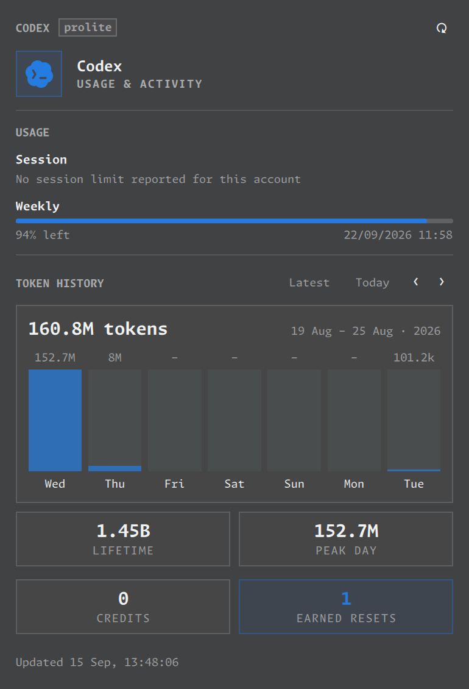

# omacodex

Codex usage, token history and credits in your Omarchy bar. Follows your theme.



## Install

```bash
omarchy plugin add https://github.com/jameswylde/omacodex.git --enable
```

Uses your existing Codex login. If needed, sign in with `codex login`.

Click the bar icon to open. Use the refresh icon to sync and the arrows to browse token history.

## Update

```bash
omarchy plugin update omacodex.usage
```

## Remove

```bash
omarchy plugin remove omacodex.usage
```
